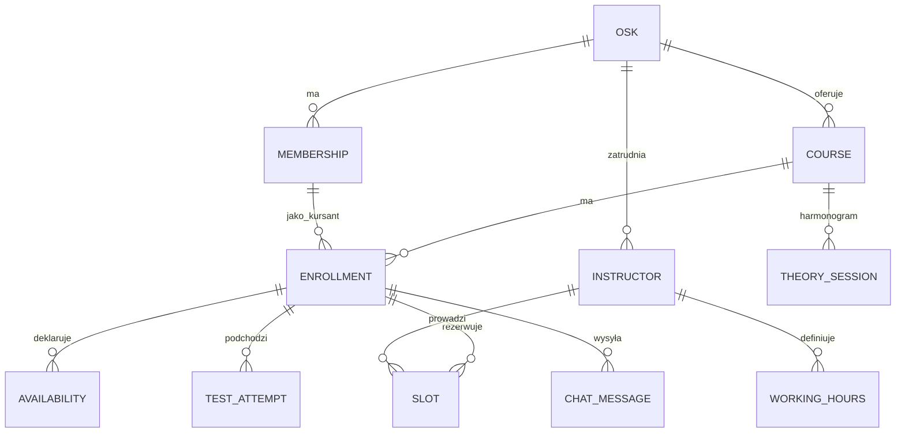
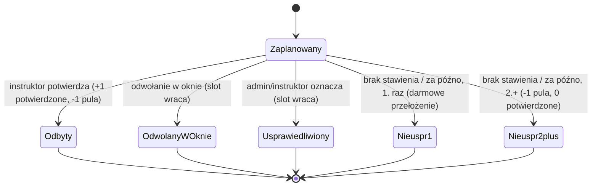

# feat: OSK Management SaaS — MVP

## Przegląd
Budujemy multi-tenantowy SaaS do zarządzania Ośrodkiem Szkolenia Kierowców.
Startujemy z jednym OSK pilotażowym, docelowo produkt dla wielu ośrodków. MVP
obejmuje lekki rdzeń operacyjny (terminarz, obecność, zliczanie godzin), silnik
odwołań/rozliczeń oraz wąski differentiator (testy z oficjalnej bazy + leaderboard).
Cały moduł płatności i program poleceń jest świadomie odłożony na v2.

Kluczowa strategia wykonawcza: **najpierw framework-agnostyczny rdzeń** (schema
Supabase + RLS + silnik jako czyste funkcje z testami), **UI w React dokładany
przyrostowo** z shadcn/ui + Claude Code. Najtrudniejszy kawałek nie dotyka Reacta.

## Ujęcie problemu
OSK potrzebują narzędzia do prowadzenia kursów; rynek na rdzeń administracyjny jest
zajęty, więc wyróżnikiem ma być warstwa nauki i grywalizacji. Pełny kontekst i
uzasadnienia — zob. źródło: `docs/dev-brainstorms/2026-07-05-osk-management-mvp-requirements.md`.

## Śledzenie wymagań
Plan realizuje wymagania z dokumentu źródłowego:
- **R1–R3** — konfiguracja OSK (konto, kursy+profil h, instruktorzy z rolą + godziny) → Unit 1, Unit 7
- **R4–R5** — onboarding kandydata (link, dane, dostępność, RODO, zgoda opiekuna, maker-checker) → Unit 4, Unit 6
- **R6–R10** — terminarz (teoria auto, praktyka rolling booking, obecność, reguły prawne) → Unit 3, Unit 7
- **R11–R14, R14a** — silnik godzin/odwołań/rozliczeń + bramka egz. wewn. + dokup + opłata za kurs → Unit 2, Unit 4
- **R14b** — gating „dopuszczony do jazd" → Unit 4, Unit 7
- **R15** — chat 1:1 → Unit 8
- **R16–R17** — strefa nauki (testy + symulacja) + leaderboard → Unit 5, Unit 8
- **R18** — wewnętrzny scoring instruktora → Unit 5, Unit 8

## Granice scope'u (non-goals MVP)
- Integracja PKK/CEK — osobny tor regulacyjny (akredytacja OSK + podpis kwalifikowany).
- Pełny optymalizator grafiku praktyki („minimalizuj czas") — v2.
- Pełne e-wykłady / teoria contentowa — v2.
- Publiczny ranking instruktorów — poza MVP.
- Test na czas z rekordem ośrodka — poza MVP.
- Cały moduł płatności online (kurs + dokup + 15 zł) i growth layer poleceń/nagród — v2.

## Kontekst i research

### Relevantne wzorce (do naśladowania)
- **Silnik oddzielony od UI (czyste funkcje + testy)** — Twój sprawdzony wzorzec
  (jak `run_audit`): logika w module bez zależności od frameworka, UI tylko go
  konsumuje. Silnik godzin i terminarza budujemy dokładnie tak.
- **Maker-checker** — Twój wzorzec z modułu HR: zgłoszenie → weryfikacja przez
  drugą osobę. Onboarding kandydata używa go do zatwierdzenia zapisu.
- **Konwencje UI** — trzymaj się reguł z Twojego skilla `code-review`
  (React 19 + TailwindCSS v4 + shadcn/ui + Supabase). Skille `code-quality` i
  `code-review` jako bramki jakości po większych unitach.

### Referencje zewnętrzne
- Format egzaminu teoretycznego (do trybu symulacji): 32 pytania (20 podstawowych
  TAK/NIE + 12 specjalistycznych A/B/C), 25 min, punktacja 3/2/1, max 74 pkt,
  próg zaliczenia 68 pkt. Dobór pytań wg kategorii (kat. B).
- Wymogi prawne kat. B: 30 h praktyki (60 min), 30 h teorii (45 min, w tym 4 h
  pierwszej pomocy); w pierwszych 8 h jazdy max 2 h na raz (spełnione przy slotach 1 h);
  min. 4 h na drogach > 70 km/h; instruktor praktyczny 1:1.
- Oficjalna baza ~3697 pytań (PWPW + ITS). Tekst jawny; media PWPW — status licencyjny
  do potwierdzenia. **Pozyskanie bazy = zależność procurement, nie zadanie kodu.**

## Kluczowe decyzje techniczne
- **Stack:** Vite + React 19 + TailwindCSS v4 + shadcn/ui (frontend), Supabase
  (Postgres + Auth + RLS + Realtime + Edge Functions) jako backend. Uzasadnienie:
  konsumencki multi-tenant SaaS, znajomy Ci Supabase, najbardziej AI-asystowalny stack.
- **Multi-tenancy:** jeden projekt Supabase, wspólna schema, kolumna `osk_id` na
  tabelach tenant-scoped, izolacja przez **RLS**. Rola użytkownika w tabeli
  `membership` (user ↔ osk ↔ rola); polityki RLS egzekwują tenant + rolę.
- **Silnik jako czysty TypeScript** (`src/engine/`) — jedno źródło prawdy dla logiki
  godzin/odwołań i terminarza; ten sam moduł TS reużyty w Edge Functions (Deno).
  DB (constraints/RLS) jako guardrail, nie jako miejsce logiki biznesowej.
- **Rezerwacja slotów transakcyjnie** przez Edge Function (uniknięcie double-booking:
  jeden instruktor : jeden kursant w danym czasie), nie po stronie klienta.
- **Sekwencjonowanie engine-first** — Fazy 1–2 (rdzeń + backend) bez Reacta; Faza 3
  dokłada UI przyrostowo, zaczynając od najmniejszego pionowego plastra.
- **Forward-compat EKK** — obecność modelowana jako **rozszerzalne zdarzenie
  weryfikacji** (`attendance_event`: start_ts, end_ts, miejsce na 2 podpisy, ślad
  GPS, `sync_status`), a nie prosty bool. Pozwala wchłonąć v2 EKK (real-time,
  dwustronny podpis, GPX, raport do CEPiK, kolejka offline) bez przepisywania rdzenia.
  Sama integracja EKK/CEPiK pozostaje poza MVP.

## Model danych (indykatywny)

## Automat stanów slotu praktycznego

## Otwarte pytania

### Rozwiązane podczas planowania
- **Metryka leaderboardu (R17):** najlepszy wynik symulacji egzaminu; tie-break —
  liczba ukończonych testów. Metryka wyodrębniona, by była łatwo zmienialna.
- **Format symulacji (R16):** jak wyżej (32/25 min/74/68, dobór wg kategorii).
- **Model dostępności (R7):** okna czasowe. Dostępność instruktora = `working_hours`
  minus zajęte sloty; dostępność kursanta = zadeklarowane okna. Sloty praktyki =
  część wspólna, pocięta na jednostki 1 h.
- **Stack i architektura multi-tenant:** rozstrzygnięte powyżej (RLS + `osk_id`).

### Odroczone do implementacji
- **Pozyskanie bazy pytań + media PWPW** — zależność procurement/licencyjna; do czasu
  jej rozwiązania Unit 5 pracuje na małym, legalnie pozyskanym zestawie seed.
- Dokładne polityki RLS i constraints — dopięcie po dotknięciu prawdziwej schemy.
- Strojenie heurystyki auto-rozpisania teorii (kolejność bloków) — po zobaczeniu
  realnych danych wykładowcy.
- Skalowanie Realtime chatu — do oceny przy realnym ruchu.

## Implementation Units

### Faza 1 — Framework-agnostyczny rdzeń (bez Reacta)

- [x] **Unit 1: Fundament multi-tenant (schema + auth + RLS)**

**Cel:** Backbone danych i izolacja tenantów. Konta OSK, użytkownicy z rolami,
podstawowe tabele domenowe.

**Wymagania:** R1, R2, R3

**Zależności:** Brak

**Pliki:**
- Stwórz: `supabase/migrations/0001_tenancy_and_core.sql`
- Stwórz: `supabase/migrations/0002_rls_policies.sql`
- Stwórz: `src/lib/supabase.ts` (klient)
- Test: `supabase/tests/rls_isolation.test.sql` (lub Vitest integracyjny na testowej instancji)

**Podejście:**
- Tabele: `osk`, `membership` (user↔osk↔rola: kandydat/kursant, instruktor,
  wykładowca, instruktor_2w1, admin), `course` (+ `h_teoria`, `h_praktyka`),
  `instructor` (+ typ roli), `working_hours`, `enrollment`.
- RLS: każda tabela tenant-scoped filtrowana po `osk_id` = osk z `membership`
  bieżącego użytkownika; dodatkowe polityki per rola (np. kursant widzi tylko swój
  `enrollment`).

**Wzorce do naśladowania:** konwencje Supabase/RLS z Twoich projektów.

**Scenariusze testowe:**
- Użytkownik OSK A nie widzi żadnych rekordów OSK B (izolacja RLS).
- Kursant nie może odczytać cudzego `enrollment`.
- Admin OSK A widzi wszystkie kursy A, żadnego z B.

**Weryfikacja:** zapytania cross-tenant zwracają 0 wierszy; role mają oczekiwany zakres.

---

- [x] **Unit 2: Silnik godzin / odwołań / obecności (pure TS)**

**Cel:** Czysta logika liczników i automatu stanów slotu + bramka egz. wewnętrznego.

**Wymagania:** R11, R12, R13, R14, R14a

**Zależności:** Brak (czyste funkcje; typy współdzielone z Unit 1)

**Pliki:**
- Stwórz: `src/engine/hours.ts` (liczniki, przejścia stanów, bramka ≥30)
- Stwórz: `src/engine/types.ts`
- Test: `src/engine/hours.test.ts` (Vitest)

**Podejście:**
- Liczniki: `potwierdzone`, `oplacone_pozostale`, `nieusprawiedliwione`, `dokupione`.
- Przejścia zgodnie z diagramem stanów; tolerancja = dokładnie 1 slot (1 h) na kurs.
- `czyDopuszczonyDoEgzaminu(stan) => potwierdzone >= 30`.
- Funkcja `ileDokupic(stan)` = max(0, 30 − (potwierdzone + rezerwowalne_z_puli)).

**Notatka wykonawcza:** Implementuj **test-first** — to czysta logika z podchwytliwymi
edge case'ami; pełne pokrycie tabelą przypadków przed spinaniem z DB.

**Scenariusze testowe:**
- 30 odbytych → dopuszczony, dokup = 0.
- 1 nieusprawiedliwione → darmowe przełożenie, pula nietknięta, dopuszczony po 30.
- 2 nieusprawiedliwione → 1 h przepada, wymaga dokupu 1 h.
- Odwołanie w oknie i „usprawiedliwione" nie ruszają puli.
- Dokupiona godzina liczy się dopiero po potwierdzeniu.

**Weryfikacja:** wszystkie przypadki tabeli przechodzą; brak zależności od UI/DB w module.

---

- [x] **Unit 3: Silnik terminarza (teoria auto + dostępność + rolling booking)**

**Cel:** Auto-harmonogram teorii, model dostępności i transakcyjna rezerwacja jazd.

**Wymagania:** R6, R7, R8, R9, R10

**Zależności:** Unit 1 (schema), Unit 2 (typy slotów)

**Pliki:**
- Stwórz: `src/engine/scheduling.ts` (auto-teoria, obliczanie wolnych okien)
- Stwórz: `supabase/migrations/0003_slots_availability.sql` (`slot`, `availability`, `theory_session`)
- Stwórz: `supabase/functions/book-slot/index.ts` (Edge Function — rezerwacja transakcyjna)
- Stwórz: `supabase/functions/generate-theory/index.ts`
- Test: `src/engine/scheduling.test.ts`

**Podejście:**
- Teoria: z `working_hours` wykładowcy generuj bloki pokrywające `h_teoria` (grupowo).
- Praktyka: wolne okna instruktora = `working_hours` − sloty zajęte; przecięcie z
  `availability` kursanta → sloty 1 h; kursant rezerwuje pojedynczo.
- `book-slot`: atomowo sprawdza kolizję (1 instruktor : 1 kursant w danym czasie),
  regułę „max 2 h na raz w pierwszych 8 h" (trywialna przy 1 h) i zapisuje slot.
- Reguła: bez „dopuszczony do jazd" (Unit 4) rezerwacja praktyki odrzucona.
- **Obecność jako `attendance_event`** (start_ts, end_ts, sloty na 2 podpisy, GPS,
  `sync_status`) — EKK-ready; w MVP wypełnia tylko instruktor retrospektywnie, ale
  struktura gotowa na v2.

**Notatka wykonawcza:** Logika okien i kolizji test-first; Edge Function tylko cienką
warstwą wokół czystej funkcji.

**Scenariusze testowe:**
- Dwóch kursantów nie zarezerwuje tego samego okna tego samego instruktora.
- Slot poza oknem dostępności instruktora/kursanta jest odrzucany.
- Auto-teoria pokrywa dokładnie `h_teoria` w godzinach wykładowcy.

**Weryfikacja:** brak double-bookingu pod współbieżnością; harmonogram teorii zgodny z profilem kursu.

### Faza 2 — Backend features (Supabase)

- [x] **Unit 4: Onboarding, zapisy, gating i śledzenie opłat**

**Cel:** Ścieżka kandydata od linku do zatwierdzonego kursanta + kontrola dostępu i płatności (offline).

**Wymagania:** R4, R5, R14a, R14b

**Zależności:** Unit 1

**Pliki:**
- Stwórz: `supabase/migrations/0004_onboarding_payments.sql`
  (`candidate_application`, `consent`, pola: `pkk_number` tekst, `payment_status`, `cleared_to_drive`)
- Stwórz: `supabase/functions/submit-application/index.ts`
- Stwórz: `supabase/functions/approve-application/index.ts` (maker-checker)
- Test: `supabase/functions/tests/onboarding.test.ts`

**Podejście:**
- Link zapisów per kurs; formularz: dane osobowe, kontakt, kategoria, `pkk_number`
  (zwykłe pole), okna dostępności, zgody RODO, zgoda opiekuna gdy < 18.
- Maker-checker: zgłoszenie → status `pending` → admin/biuro zatwierdza → tworzy `enrollment`.
- `payment_status` (kurs) i `cleared_to_drive` ustawiane ręcznie przez admina
  (obsługa rat). Bez „cleared_to_drive" rezerwacja praktyki (Unit 3) odrzucona;
  teoria i strefa nauki dostępne po zatwierdzeniu.

**Scenariusze testowe:**
- Niepełnoletni bez zgody opiekuna — zgłoszenie niekompletne.
- Zgłoszenie `pending` nie daje dostępu do jazd.
- Admin zatwierdza → powstaje `enrollment`; ustawia `cleared_to_drive` → rezerwacja przechodzi.

**Weryfikacja:** ścieżka link→formularz→zatwierdzenie→dostęp działa; gating blokuje jazdy bez flagi.

---

- [x] **Unit 5: Strefa nauki + grywalizacja (backend)**

**Cel:** Model bazy pytań, logika testów/symulacji, leaderboard, wewnętrzny scoring instruktora.

**Wymagania:** R16, R17, R18

**Zależności:** Unit 1

**Pliki:**
- Stwórz: `supabase/migrations/0005_learning_gamification.sql`
  (`question`, `test_attempt`, `answer`, `instructor_feedback`)
- Stwórz: `src/engine/exam.ts` (dobór pytań, punktacja 3/2/1, próg 68/74)
- Stwórz: `src/engine/leaderboard.ts` (ranking po najlepszym wyniku symulacji)
- Test: `src/engine/exam.test.ts`, `src/engine/leaderboard.test.ts`

**Podejście:**
- `question`: treść, kategoria, typ (podstawowe/specjalistyczne), waga, poprawna odp.
  Seed małym legalnym zestawem do czasu procurementu pełnej bazy. **Model elastyczny**
  — baza w reformie (~3500→~1500, nowe Centrum Egzaminowania ITS); nie zaszywać liczby ani struktury.
- Tryb nauki (swobodny) + tryb symulacji (32 pytania, 25 min, punktacja, próg).
- Leaderboard scope = jeden kurs; metryka wyodrębniona (łatwa zmiana).
- `instructor_feedback` → prywatny scoring widoczny tylko dla admina (RLS).

**Notatka wykonawcza:** Punktacja i dobór pytań test-first.

**Scenariusze testowe:**
- Symulacja dobiera 20+12 wg kategorii; punktacja sumuje do ≤74; próg 68 rozstrzyga.
- Leaderboard porządkuje po najlepszym wyniku, tie-break po liczbie testów.
- Scoring instruktora niewidoczny dla ról innych niż admin (RLS).

**Weryfikacja:** wyniki symulacji zgodne z regułami WORD; leaderboard poprawnie uporządkowany; scoring odizolowany.

### Faza 3 — UI React (przyrostowo, shadcn/ui + Claude Code)

- [x] **Unit 6: App shell + auth + routing ról + formularz zapisów (pierwszy plaster)**

**Cel:** Fundament frontendu i najmniejszy pionowy plaster end-to-end (onboarding), by zbudować pewność.

**Wymagania:** R4 (UI)

**Zależności:** Unit 1, Unit 4

**Pliki:**
- Stwórz: `src/main.tsx`, `src/app/router.tsx`, `src/components/ui/*` (shadcn)
- Stwórz: `src/features/auth/*`, `src/features/onboarding/ApplicationForm.tsx`
- Test: `src/features/onboarding/ApplicationForm.test.tsx` (React Testing Library),
  `e2e/onboarding.spec.ts` (Playwright)

**Podejście:**
- Supabase Auth + routing zależny od roli z `membership`.
- Publiczny formularz zapisów spinający `submit-application` (Unit 4).
- Trzymaj się konwencji ze skilla `code-review`.

**Scenariusze testowe:**
- Formularz waliduje wymagane pola + zgodę opiekuna dla < 18.
- Po submit zgłoszenie widoczne jako `pending` u admina.
- Routing kieruje rolę na właściwy dashboard.

**Weryfikacja:** kandydat przechodzi zapis z przeglądarki; auth i routing ról działają.

---

- [x] **Unit 7: Admin (konfiguracja OSK) + terminarz per rola**

**Cel:** UI konfiguracji OSK oraz widoki terminarza dla kursanta/instruktora/admina, w tym obecność i licznik godzin.

**Wymagania:** R1, R2, R3, R6, R7, R8, R9, R14b (UI)

**Zależności:** Unit 3, Unit 6

**Pliki:**
- Stwórz: `src/features/admin/*` (kursy, instruktorzy+role, godziny pracy)
- Stwórz: `src/features/schedule/*` (widoki: kursant zapisy/odwołania,
  instruktor potwierdzanie obecności, admin przegląd)
- Stwórz: `src/features/progress/HoursProgress.tsx` (pasek „/30 h")
- Test: `src/features/schedule/*.test.tsx`, `e2e/booking.spec.ts`

**Podejście:**
- Admin ustawia kursy/instruktorów/godziny; zamyka zapisy → wyzwala auto-teorię
  i otwarcie slotów praktyki.
- Kursant: rezerwacja/odwołanie slotu; widok licznika i postępu.
- Instruktor: potwierdzanie obecności (zamyka slot, dolicza godzinę).

**Scenariusze testowe:**
- Odwołanie w oknie zwalnia slot; po oknie uruchamia logikę tolerancji (Unit 2).
- Potwierdzenie obecności zwiększa licznik i postęp.
- Kursant bez „cleared_to_drive" nie widzi/nie rezerwuje jazd.

**Weryfikacja:** pełny cykl rezerwacja→obecność→licznik działa dla wszystkich ról.

---

- [x] **Unit 8: Strefa nauki UI + leaderboard + chat 1:1**

**Cel:** Konsumencki differentiator: testy, symulacja, ranking kursu, chat na żywo.

**Wymagania:** R15, R16, R17, R18 (UI)

**Zależności:** Unit 5, Unit 6

**Pliki:**
- Stwórz: `src/features/learning/*` (tryb nauki, symulacja egzaminu)
- Stwórz: `src/features/leaderboard/*`
- Stwórz: `src/features/chat/*` (Supabase Realtime, 1:1 kursant↔instruktor, kursant↔biuro)
- Stwórz: `src/features/admin/InstructorScoring.tsx` (tylko admin)
- Test: `src/features/learning/*.test.tsx`, `e2e/exam-sim.spec.ts`

**Podejście:**
- Symulacja odwzorowuje warunki WORD (32/25 min/punktacja/próg).
- Leaderboard kursu z metryki z Unit 5; mobile-first.
- Chat na Supabase Realtime; scoring instruktora tylko w widoku admina.

**Scenariusze testowe:**
- Symulacja egzekwuje limit czasu i punktację; wynik zasila leaderboard.
- Wiadomość chatu dociera w czasie rzeczywistym do właściwego odbiorcy.
- Scoring instruktora niewidoczny dla kursanta/instruktora.

**Weryfikacja:** kursant rozwiązuje symulację, widzi ranking i pisze na chacie z telefonu.

## Wpływ systemowy
- **Graf interakcji:** `book-slot` i potwierdzanie obecności wyzwalają aktualizację
  liczników (Unit 2); zamknięcie zapisów wyzwala auto-teorię i otwarcie slotów.
- **Propagacja błędów:** rezerwacja i rozliczenia muszą zawodzić bezpiecznie
  (transakcyjnie) — częściowy zapis nie może rozjechać liczników.
- **Ryzyka cyklu życia stanu:** double-booking, wyścig przy równoległej rezerwacji,
  desynchronizacja `oplacone_pozostale` vs `potwierdzone`.
- **Parytet surface:** logika liczników używana i w UI (podgląd), i w Edge Function
  (zapis) — jedno źródło = moduł `src/engine`.
- **Pokrycie integracyjne:** e2e na ścieżce rezerwacja→obecność→bramka egz. wewn.

## Ryzyka i zależności
- **Pozyskanie bazy pytań + media PWPW** — zależność procurement/licencyjna; blokuje
  pełną wartość Unit 5, ale nie start (seed).
- **Współbieżność rezerwacji** — wymaga transakcyjnego `book-slot` z blokadą kolizji.
- **Krzywa uczenia React** — mitygowana sekwencją engine-first i shadcn/ui + Claude Code.
- **RLS multi-tenant** — błąd polityki = wyciek między OSK; stąd testy izolacji w Unit 1.
- **Nadchodząca regulacja EKK** — może stać się table-stakes szybciej niż „kiedyś w v2"
  (projekt celuje w II kw. 2026, konkurencja już buduje). Mitygacja: forward-compat
  attendance_event w MVP; monitoruj status ustawy i planuj tor EKK/CEPiK zaraz po MVP.

## Rozważane alternatywy
- **Streamlit + Supabase** — szybszy dla Ciebie, ale sufit na konsumenckim, multi-role,
  mobilnym UX; odrzucone jako fundament produktu (ewentualnie do wewnętrznych narzędzi).
- **Next.js** — mocny „standard SaaS", ale więcej runtime'u do ogarnięcia; Vite SPA +
  Supabase prostsze koncepcyjnie na start. Można wrócić przy SSR/SEO.
- **Frappe** — masz ekosystem, ale ciężki i mniej elastyczny dla grywalizowanego,
  konsumenckiego UX.
- **Silnik w Postgres (funkcje/triggery)** — odrzucone; logika w czystym TS jest
  łatwiejsza do testowania i reużycia, DB zostaje guardrailem.

## Przyszłe rozważania (v2: EKK / CEPiK)
Projekt ustawy (RCL, cel przyjęcia II kw. 2026) wprowadzi Elektroniczną Kartę
Kursanta: rejestrację jazd w czasie rzeczywistym, indywidualne numery kursanta i
instruktora, dwustronny podpis w apce mobilnej, zapis trasy GPX/GPS i auto-raport do
CEPiK. To zmienia potwierdzanie obecności z retrospektywnego/jednostronnego na
real-time/dwustronne. Wpływ na obecny design:
- **Attendance jako zdarzenie** (Unit 3) — już zaprojektowane pod te pola.
- **Apka mobilna instruktora z kolejką offline→online** — kluczowy nowy komponent v2;
  lokalny timestamp + synchronizacja po odzyskaniu sieci. Zasada: minimum kliknięć
  (ryzyko sabotażu przy aucie).
- **Integracja z API rządowym + weryfikacja tożsamości** (profil zaufany / mObywatel) — tor regulacyjny, jak PKK.
- **Baza pytań** — reforma (~3500→~1500, ITS); model pytań elastyczny (Unit 5).

## Fazowe dostarczanie
- **Faza 1 (Unit 1–3):** rdzeń bez Reacta — schema, izolacja, silniki z testami. Największa wartość i ryzyko, zero UI.
- **Faza 2 (Unit 4–5):** backend feature'ów — onboarding/gating/płatności-offline + strefa nauki/grywalizacja.
- **Faza 3 (Unit 6–8):** UI React przyrostowo, od najmniejszego plastra (onboarding) po pełny differentiator.

## Dokumentacja / notatki operacyjne
- Po Fazie 1: krótki opis kontraktu silników (wejście/wyjście) dla łatwego spinania UI.
- Procurement bazy pytań prowadź równolegle do Faz 1–2, by Unit 5 miał pełne dane.
- Po większych unitach: przepuść przez skille `code-review` i `code-quality`.

## Źródła i referencje
- **Dokument źródłowy:** `docs/dev-brainstorms/2026-07-05-osk-management-mvp-requirements.md`
- Konwencje UI/jakości: skille `code-review`, `code-quality`
- Format egzaminu / wymogi kat. B: research w dokumencie źródłowym
